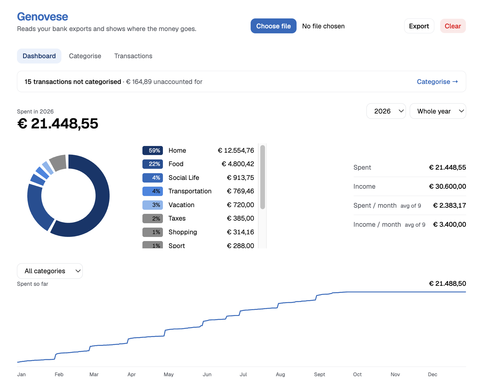

# Genovese

A personal expense tracker: reads bank data and shows insights in the browser. Data stays locally.



_Supported banks: Revolut, ING, Mediolanum._

## Why?

It came from a personal need after manually adding my expenses every day in an Android application (credits to
Money Manager).

## What?

It's a personal expense tracker. It mainly does three things:

1. Parses CSV bank statements into transactions. Core elements of a transaction are the amount and the merchant.
2. Categorises transactions' merchants into a set of spending categories like: Grocery, Home, Transport, etc.
3. Visualises the transaction data in a dashboard.

## How?

A statement can be loaded using the choose file button. To assign a category to a merchant go into the category tab.
Data is stored in the excel file that can be exported via the export button. The excel file is the database and
source of truth of the application.

The flow looks like:
load CSV statement -> Assign categories to merchants -> Visualise the data -> Export the data.

An exported file can be loaded like a CSV statement. It carries the merchants-categories mapping.
Multiple files can be loaded at a time.

## Design decisions

Some decisions worth explaining.

### Spreadsheet as database

This mainly comes from my personal need and from the experience that browsers are usually not reliable.

My data is already saved in a spreadsheet. The database is already there, the unique source of truth is already there.

If I mess up editing or the browser messes up I don't lose my already stored data -> I can manually manage file versions and backups with the export functionality.

## Stack

Runs entirely in the browser: no backend, no accounts, no network calls.

- **UI** — React 19, TypeScript 6 (strict), Vite 8, Tailwind 4, shadcn/ui on Base UI.
- **Data** — Papa Parse (CSV), SheetJS (xlsx), Dexie 4 over IndexedDB for working state.
- **Tooling** — Vitest, oxlint, Prettier, pnpm 12 on Node 24.

## Deploy

### Locally

You can build and run the application with the following commands:

```
pnpm dev      # dev server with hot reload
pnpm build    # type-check + produce dist/
```

Application will be live at http://localhost:5173/.

### GitHub pages

WIP
